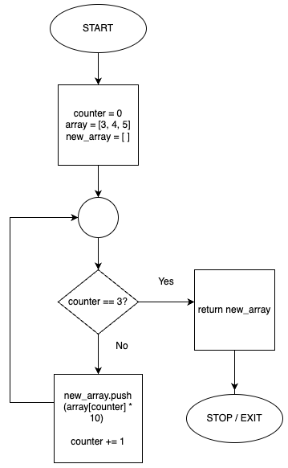
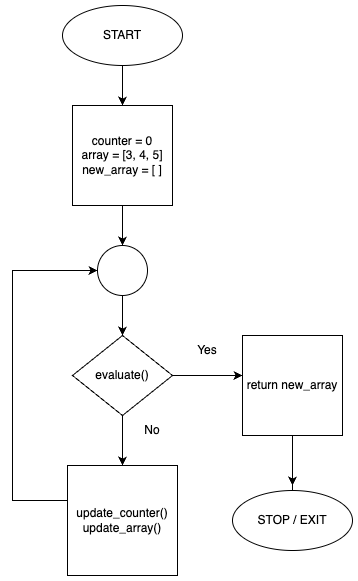

# <ins>RB101/RB109 MEGA-LIST</ins>
> This is a file where I will be collecting as many lessons and important material from RB101. </br>
>
> **My goal with this document:**
> 1. Provide concise and exact definitions for common terms. </br> 
>     _(Refer to "Defining Terms" sections)_
> 2. Provide walkthroughs of the material
> 3. Provide practice questions with answers (that you can toggle to show/hide) from both the course material and my own creation.

<br>

## Table Of Contents:

1. ### Ruby Style 🎨

2. ### Truthy & Falsy Values ☯️
    - #### Defining Terms 📖
    - #### `true` & `false` 🆚 Truthy & Falsy  
    - #### Logical & Comparison Operators 
      - Short Circuiting 

3. ### Pre-Coding Processes 🛠️
    - #### Defining Terms 📖  
    - #### Pseudocode 
    - #### Flowcharts 

5. ### Rubocop 🚓
    - #### Defining Terms 📖
    - #### Using Rubocop 

6. ### Debugging 🐛

7. ### Operator Precedence 🂾
    - #### Defining Terms 📖

8. ### Variables 🎳
    - #### Defining Terms 📖
    - #### Variables as pointers 
    - #### Variable shadowing 
    - #### Local variable scope in method definitions
    - #### Local Variable Scope in Blocks (including nested blocks and peer blocks)
    - #### Scope of Constants
    - #### Mutating Values 🆚 Reassigning Variables

9. ### Methods:
    - #### Method Definition 🆚 Method Invocation
    - #### Passing and Using Blocks with Methods
    - #### Parameters 🆚 Aarguments
    - #### Default parameters
    - #### Implicit 🆚 Explicit return values
    - #### Mutating 🆚 Non-mutating methods
    - #### Using method return values as arguments to other methods

10. ### Mutable 🆚 Immutable Data Types
11. ### Output 🆚 return
12. ### How Objects Are Passed Around 📬
      - #### Pass By Reference 
      - #### Pass By Value 
      - #### Call By Sharing 

<br>
<br>
<br>

---------------------------------------------------------------------------------------------------------
---------------------------------------------------------------------------------------------------------
--------------------------------------------------------------------------------------------------------

<br>

# Ruby Style 🎨
In Ruby there are styling conventions that are followed to maintain better readability and consistency across developer's appilications. Here are some of the general style rules for Ruby that most developers follow:
- For blocks, if the code can be short and concise make it a one-liner using `{ }`. Otherwise use a `do/end`.
- Always use _snake_case_ for nameing variables
- Always use _UPPERCASE_ for naming constants
- Always use _CamelCase_ for naming Classes
- Indentations with tabs is 2 spaces

<br>

---------------------------------------------------------------------------------------------------------
---------------------------------------------------------------------------------------------------------

<br>

# Truthy & Falsy Values ☯️
### Defining Terms 📖
***Expression :*** 
  > An expression is any piece of code that can be evaluated down to a single return value. This includes almost everything in Ruby </br>
  > Conditionals, objects, logical expressions, variables, methods, loops, arithmetic operations and etc </br>
  > Are all things that could techincally be considered expressions. </br>
  > In some programming languages there are constructs that don't allow things like loops and conditionals to return a value. In Ruby almost everything returns a value, therefore almost everything in Ruby can be considered an expression.

***Boolean Expression :***
  > This is an _expression_ that evaluates and returns either a `true` or `false` value.

***`true` :*** </br>
  > `true` is an object in Ruby that represents the boolean 'true'. </br>
  > The `true` object is often times returned from conditional statements, comparison expressions or logical expressions to express the 'true' or 'truthy' value of an expression. </br>
  > Every expression in Ruby will evaluate to `true` except for values of `nil` or `false`

***`false` :*** 
  > `false` is an object in Ruby that represents the boolean 'false'. </br>
  > The `false` object is often times returned from conditional statements, comparison expressions or logical expressions to express the 'false' or 'falsy' value of an expression. </br>
  > The only objects and return values that will evaluate to `false` are `false` itself and `nil`. 

***Operator :***
  > A symbol used in an expression that performs an operation on one or more values. These values are genreally known as _operands_.
  > _Example:_ `a && (b * 10)` </br>
  > Where `a` and `(b * 10)` are operands to the operator, `&&`. </br>
  > And `b` and `10` are operands to the operator, `*`.

***Operand :***
  > A value being operated on by an operator. </br>
  > _Example:_ `(a + b) > 100` </br>
  > Where `(a + b)` and `100` are operands to the operator `>`.
  > And `a` and `b` are operands to the operator, `+`.

***Truthy :***
  > '_Truthy_' is a term used to describe any value that evaluates to `true` in a boolean context. </br>
  Luckily, Ruby follows 1 simple rule: Every value can be evaluated as `true` (truthy) except for `false` and `nil` (falsy).<br>
  Because of this, it allows us to compare values of varying data types to return a value from a boolean expression.</br>
  It allows us the ability to make expressions _like this:_ </br>
  > ```ruby
  > a = 'hello' || nil # 'hello' will evaluate to `true`. 'hello' is 'truthy'.
  >
  > puts a # "hello"
  > ```
  > There are many more examples, but this is just one to illustrate the idea of truthy.

***Falsy :***
  > 'Falsy' is a term used to describe any value that evaluates to `false` in a boolean context. </br>
  > `nil` and `false` are the only 'falsy' values in Ruby. </br>
  > As with 'truthy', 'falsy' is a way to allow us to compare values of varying data types to return a value from a boolean expresion.

<br>

---------------------------------------------------------------------------------------------------------

<br>

### `true` & `false` 🆚 Truthy & Falsy 
  `true` and `false` are not strictly equivalent to other values that are 'truthy' or 'falsy'. </br>
  To illustrate, here is an example:
  > ```ruby
  > 'hello' == true # false
  > ```
  > This is because the truthy value of 'hello' is just a mechanism for a String to return a `true` value in a boolean context. </br>
  In context to our example, we are comparing the the String object 'hello' as whole, to the `true` object as a whole. </br>
  Truthy and falsy are simply just ways to describe if something is 'true' or 'false', it does not make the objects themselves `true` or `false` objects. </br>
  In the context of representing an instance of a `true` or `false` object, truthy and falsy values are not this.
  This concept is the same for falsy values as well:
  > ```ruby
  > nil == false # false
  > ```

<br>

---------------------------------------------------------------------------------------------------------

<br>

### Logical & Comparison Operators 
  Logical and comparison operators are super important in control flow and conditional statements in programming in Ruby (and in general). </br>
  Comparison operators are used to compare two operands against eachother and return a boolean based on that comparison. </br>
  Logical operators are used to combine multiple expressions and determine how the expressions are evaluated, resulting in a boolean. These are used in more complex conditional statements.</br>
  > _Comparison operators include:_
  > - `==` ~ Equality operator
  >   - Is a binary operator (takes 2 operands) 
  >   - If both operands are equal in value, `true` is returned, otherwise, `false` is returned
  > - `<=` ~ Equal to or Less than
  >   - Is a binary operator (takes 2 operands)
  >   - If the left operand is equal to OR less than the right operand, `true` is returned, otherwise, `false` is returned
  > - `>=` ~ Equal to or greater than
  >   - Is a binary operator (takes 2 operands)
  >   - If the left operand is equal to OR greater than the right operand, `true` is returned, otherwise, `false` is returned
  > - `>` ~ Greater than
  >   - Is a binary operator (takes 2 operands)
  >   - If the left operand is greater than the right operand, `true` is returned, otherwise, `false` is returned
  > - `<` ~ Less than
  >   - Is a binary operator (takes 2 operands)
  >   - If the left operand is less than the right operand, `true` is returned, otherwise, `false` is returned
  > - `!=` ~ Inequality operator
  >   - Is a binary operator (takes 2 operands)
  >   - If both operands are ***NOT*** equal in value, `true` is returned, otherwise, `false` is returned
  > <br>
  >
  > _Logical Operators include:_
  > - `&&` ~ AND
  >   - Is a binary operator (takes 2 operands)
  >   - If both operands have to evaluate to `true` in order for the expression to return `true`  
  >   - Evaluates from left operand to right operand
  > - `||` ~ OR
  >   - Is a binary operator (takes 2 operands)
  >   - If one of the two operands evaluates to `true` the expression will return `true`
  >   - Evaluates from left operand to right operand
  > - `!` ~ NOT
  >   - Unary operator (takes 1 operand)
  >   - Negates the truthy/falsy value of the operand </br>
  >
  > <br>
  > 
#### **Short Circuiting** ⚡️
  > As mentioned above, binary logical operators like `&&` and `||` will evaluate objects from left to right. </br>
  > The concept of ***short circuiting*** is when our expression with a logical operator doesn't evaluate the right operand in the expression. </br>
  > 
  > _How does this work and why?_ </br>
  > <br>
  > In the case of the `&&` operator, both operands, left and right, have to evaluate to `true`. </br>
  > This means if the first operand, the left one, evaluates to `false`, then there is no point in evaluating the right operand as both operands have to evaluate to `true` anyways, so the overall expression cannot be `true`. </br>
  > So the `&&` stops it's evaluating if it encounters an operand that returns `false`, meaning if the left operand evaluates to false, then the right operand is never evaluated. </br>
  > <br>
  > In the case of the `||` operator, only 1 operand has to evaluate to true in order for `true` to be returned from the  logical expression. </br>
  > This means, if the first operand evaluates to `true`, then the expression stops evaluating and returns `true`, never evaluating the second operand. And why would it? If it only needs one of the operands to evaluate to `true` then it doesn't need to evaluate the next operand. </br>
  > <br>
  > Short circuiting is when an expression using a logical operator returns a value before evaluating the entire expression.
  > <br>
  > _Here's an example to illustrate:_
  > ```ruby
  > a = nil && 10
  > b = 10 || false
  >
  > p a # nil
  > p b # 10
  > ```
  > In the example above, `a` evaluates to `nil` because `nil` was the last operand to be evaluated in the expression. </br>
  > `b` evaluates to `10` because `10` was the last operand to be evaluated in the expression.

<br>

---------------------------------------------------------------------------------------------------------
---------------------------------------------------------------------------------------------------------

<br>

# Pre-Coding Processes 🛠️
### Defining Terms 📖
***Pseudocode :*** 
  > Code that mimics spoken language, like English. This code is not machine-readable or used in production but is used for abstracting out the syntax of a problem or application in a way that is easier to conceptualize.

***Flowchart :*** 
  > A visual illustration that helps map out the flow of an application using geometric shapes and lines.

<br>

---------------------------------------------------------------------------------------------------------

### Pseudocode 💻
  > The concept of pseudocode is to help abstract out the details in syntax to help focus efforts towards the control flow and bigger picture overview of an application. </br>
  > <br>
  >
  > Some pseudocode makes use of some syntax, while other pseudocode is purely English.
  > The level of abstraction you use with your pseduocode will highly depend. 
  > Generally, we can start by writing out our program in mostly-English pseudocode and on another iteration of the problem in pseudocode we can add some syntax to it. </br>
  > <br>
  >
  > When writing or typing out pseudocode we can either choose to include the details of a method or set of operations or just label them as a set of operations that we can later write pseudocode for. Depending on what 'layer' of the program we are on we can choose whether we want to include all the steps of a certain set of operations or not.
  > <br>
  > <br>
  > 
  > _Some pseudocode may look like:_
  > ```
  > initialize `counter` variable to `0`
  > initialize an `array` to `[3, 4, 5]`
  > initialize `new array` to `[]``
  >
  > loop until counter is equal to 3
  >   push `array[counter]` times 10, to `new array`
  >   increment counter by 1
  >
  > return `new array`
  > ```
  > If we wrote a more formal and less abstracted pseudocode...
  > _It might look like this:_
  > ```
  > counter = 0
  > array = [3, 4, 5]
  > new_array = []
  > 
  > START LOOP
  > BREAK IF counter is equal to 3
  >   new_array push ( array[counter] * 10 )
  >   counter = counter + 1
  > END LOOP
  >
  > return new_array
  > ```

<br>

---------------------------------------------------------------------------------------------------------

<br>

### Flowcharts 📊
  > The concept of a flowchart is similar to that of pseudocode: it's to help abstract out the details in syntax to help focus efforts towards the control flow and bigger picture overview of an application.
  >
  > <p align='center'>
  >   
  > </p>
  > 
  > And again, making these flowcharts we can either choose to include the details of a method or set of operations or just label them as a set of operations that we can later map out. Depending on what 'layer' of the program we are on we can choose whether we want to include all the steps of a certain set of operations or not. </br>
  > _For example:_
  > <p align='center'>
  >   
  > </p>
  > <br>
  > Here we've abstracted some sets of operations out of our program to get a better high-level overview of the program. We can make separate flowcharts for these hidden operations later if we want to.

<br>

---------------------------------------------------------------------------------------------------------
---------------------------------------------------------------------------------------------------------

<br>

# Rubocop 🚓
### Defining Terms 📖
***Style/Code Formatter :*** 
  > A _style formatter_ is a tool that will automatically enforce style rules and conventions on your code. </br>
  > <br>
  > These rules can include:</br>
  > - Number of spaces for tab indentations
  > - Naming conventions
  > - Line Spacing
  > - Comment formatting </br>

***Code Linter :*** 
  > A _code linter_ is a tool that inspects your code for potential logical errors, poor readability, style conventions and error-prone code, and alerts you to these errors. </br>
  > <br>
  > These can include: </br>
  > - Variable shadowings
  > - Unused Local Variables
  > - Trailing whitespaces
  > - Not Following Naming Conventions
  > - Syntax Errors
  >
  > A _code linter_ will usually alert you to these problems through highlighting or reporting the errors to you in your terminal. </>

***Static Code Analyzer :*** 
  > Is a tool that inspects your code for potential logical errors as well as style errors, without executing the code (hence the 'static' part). Static Code Analyzers are very similar to code linters, but go more in depth and take more aspects of your program into account, like the structure, security, styling, and potential logical errors.</br>

***Rubocop :*** 
  > Is a static code analyzer used specifically in Ruby applications. </br>

<br>

---------------------------------------------------------------------------------------------------------

### Using Rubocop
  > Once the Rubcop gem is installed, you can then use the `rubocop` command in the terminal. This means you can now use `rubocop <file.rb>` and have Rubocop analyze your code for you. </br>
  > <br>
  > Rubocop has _**"offenses"**_. These offenses are things that Rubocop has found in your code that it deems to be a potential problem or error-prone. </br>
  > Rubocop has a lot of different offenses that are categorized even further into different _**"departments"**_, departments being different categories of offenses. </br>
  > <br>
  >
  > Let's say we have a file names `tests.rb` that just has this in it:
  >```ruby
  >Kernel.puts ("Hello world")
  >```
  >If we run `rubocop tests.rb` this is the message we'll recieve:
  >```
  >  Inspecting 1 file
  >W
  >
  >Offenses:
  >
  >tests.rb:1:1: C: [Correctable] Style/FrozenStringLiteralComment: Missing frozen string literal comment.
  >Kernel.puts ("Hello world")
  >^
  >tests.rb:1:12: W: [Correctable] Lint/ParenthesesAsGroupedExpression: ("Hello world") interpreted as grouped expression.
  >Kernel.puts ("Hello world")
  >          ^
  >tests.rb:1:14: C: [Correctable] Style/StringLiterals: Prefer single-quoted strings when you don't need string interpolation >or special symbols.
  >Kernel.puts ("Hello world")
  >            ^^^^^^^^^^^^^
  >tests.rb:1:28: C: [Correctable] Layout/TrailingEmptyLines: Final newline missing.
  >Kernel.puts ("Hello world")
  >                         
  >
  >1 file inspected, 4 offenses detected, 4 offenses autocorrectable
  >```
  > As you can see, rubocop has given us 4 offenses to fix </br>
  > Rubocop has always given our offenses a type too. The `C`s stand for 'convention', this means we've broken a style convention in Ruby and `W`s stand for 'warning' which means our code doesn't cause and error, but is something to look out for as it could potentially cause an error in the future. </br>
  > <br> 
  > Following the stack trace it gives us to where the offense was detected and the offense type, it tells us what the offense itself is and on the next line points us to where the offense was detected.</br>
  > <br>
  > Let's make some changes to our file:
  > ```ruby
  > Kernel.puts('Hello world')
  > 
  > ```
  > And then we run rubocop on our file, `rubocop tests.rb`:
  >```
  >  Inspecting 1 file
  >C
  >
  >Offenses:
  >
  >tests.rb:1:1: C: [Correctable] Style/FrozenStringLiteralComment: Missing frozen string literal comment.
  >Kernel.puts('Hello world')
  >^
  >
  >1 file inspected, 1 offense detected, 1 offense autocorrectable
  >```
  > As you can see, we've corrected most of our offenses. Not all offenses displayed by Rubocop will always be worth fixing, and what offenses you decided to fix will be up to you. In this case, Rubocop is just giving us a 'Convention' offense, so we may just decide to ignore it 🤷‍♂️ </br>
  > <br>
  > We can also configure Rubocop to enforce certain offenses, making it more or less strict and more customized to our needs by including a `.yml` file named: `.rubocop.yml`. 

<br>

---------------------------------------------------------------------------------------------------------
---------------------------------------------------------------------------------------------------------

<br>

# Debugging 🐛
  > Debugging is the process of fixing errors in your code. </br>
  > <br> 
  > **The mindset to debugging...** </br>
  > Most of a software engineers job isn't coding. It's debugging. </br>
  ><br>
  > Debugging takes time, patience and an engineers-mindset. This means having the right temperment for it. This temperment should be a solution-focused approach to problems that is patience and takes its time. </br>When problems arise, we don't feel good about it, it's difficult and it's not the way we generally want things to go. If you let negative emotions eat you up in the process of debugging, you're going to have a hard time mastering the craft. </br>
  > <br>
  > If you're going to hone the art of debugging, you need to approach problems logically and systematically, wtih a patient temperment.</br> 
  > _Like a ninja_ - you don't attack the problem/threat in a fury or emotion. You want to approach it cool, controlled and with intention. </br>
  > <br>
  > _**Here are some tricks and steps for debugging an application:**_ </br>
  > 1. ***Reproduce the Error*** </br>
  >  You generally want to be able to reproduce the error on your own local environment first. </br>
  >  This is done so that you can work on it, but also by doing so allows you to better understand how the error is encountered in the first place, thus furthering your understanding of the error itself and the potential solution for it.
  > <br>
  >
  > 2. ***Determine Boundaries*** </br>
  >    Determine the boundary/scope of your error. This means playing around with the code and containing the error to a smaller > scope, variable or class. You can do this by removing certain parts of your code like variables or method calls and seeing >if the error still arises. </br> </br>
  >    For example, let's say we get an error from an instance method in our code: </br>
  >        ```ruby
  >        my_obj.my_method(my_var)
  >        ```
  >    If we wanted to figure out the boundaries of the error, we want to break down the different parts involved: </br>
  >    - my_obj
  >    - my_method
  >    - my_var </br>
  >
  >    Maybe we try accessing `my_obj` first and seeing if the error is reproduced: </br>
  >    `p my_obj` </br>
  >    Then we could try seeing if it's the `my_method` being called by `my_obj` that produces the error, or we could try > calling   `my_method` on a different instance and seeing if it produces the error: </br>
  >     `my_obj.my_method()` </br>
  >     `other_obj.my_method()` </br>
  >     We could also try accessing `my_var` and seeing if the error is reproduced: </br>
  >    `p my_var` </br>
  >     <br>
  >    These are all just ways to see where the error is contained to. If we only got an error with calling `my_var` then we >could assume it's a problem with the variable `my_var`, otherwise it could be a problem with the method itself of the >`my_obj` object. </br> 
  >
  > 3. ***Trace the Code*** </br>
  >   Trace the code. This means following your code, part by part, method call by method call to scope out where an error might've occured. Along a set of operations, at what specific step did the error occur?</br>
  > <br>
  > 4. ***Understand the Problem Well***
  >  This is where you do some tweaking to your code. Now that we've narrowed down the scope/boundary of the problem and we've traced the code to the line that is causing the problem, let's understand it fully. This means taking each of the individual pieces and seeing what they return and what they do. </br>
  > <br>
  > 5. ***Implement a Fix*** </br>
  > Now, implement a fix to the bug. </br>
  > <br>
  > 6. ***Test Your Fix*** </br>
  > Test out your fix and see if it gives you the results you want without the error.
  > <br>

<br>

---------------------------------------------------------------------------------------------------------
---------------------------------------------------------------------------------------------------------

<br>

# Operator Precedence 🂾
Operator precedence refers to the order in which operators in an expression will be evaluated. </br>

### Defining Terms 📖
***Expression :*** 
  > An expression is any piece of code that can be evaluated down to a single return value. This includes almost everything in Ruby </br>
  > Conditionals, objects, logical expressions, variables, methods, loops, arithmetic operations and etc </br>
  > Are all things that could techincally be considered expressions. </br>
  > In some programming languages there are constructs that don't allow things like loops and conditionals to return a value. In Ruby almost everything returns a value, therefore almost everything in Ruby can be considered an expression.
  
***Operator :***
  > A symbol used in an expression that performs an operation on one or more values. These values are genreally known as _operands_.
  > _Example:_ `a && (b * 10)` </br>
  > Where `a` and `(b * 10)` are operands to the operator, `&&`. </br>
  > And `b` and `10` are operands to the operator, `*`.

***Operand :***
  > A value being operated on by an operator. </br>
  > _Example:_ `(a + b) > 100` </br>
  > Where `(a + b)` and `100` are operands to the operator `>`.
  > And `a` and `b` are operands to the operator, `+`.

<br>

---------------------------------------------------------------------------------------------------------

> In an expression that nests multiple other expressions, how do we decide what expressions are evaluated first? </br>
> _Let's start with an example:_
>```ruby
>3 + 7 * 10 #=> 73
>```
> Why does the code example above return `73` and not `100`? </br>
> Why doesn't it evaluate like this: `3 + 7 = 10` and then `10 * 10 = 100`? </br>
> The code above evaluates `7 * 10` first which equals `70` and then it evaluates `3 + 70`. </br>
> <br>
> Just like we have order of operations in mathematics, we have order of operations (precedence) in programming. </br>
> <br>
> _So what about this? :_
>```ruby
> true || false && 10 && "hello" || 7.5 #=> true
>```
> The above example returns `true`. Why? </br>
> How is this evaluated? </br>
> Well, if we just did this left to right, in sequence of each operator and it's operands, it might look something like this:
> _(We'll do each operator-operand combo from left to right)_
>```ruby
> # 1st step:
> true && 10 && 'hello' || 7.5
>```
>```ruby
> # 2nd step:
> 10 && 'hello' || 7.5
>```
>```ruby
> # 3rd step:
> 'hello' || 7.5
>```
>```ruby
> # 4th step:
> 'hello'
>```
> <br>
> So why does the expression evaluate to `true`, even though going in sequence from left to right gives us `'hello'`? </br>
> Well, it's because the `&&` operator holds a higher precedence than the `||` operator. </br>
> This is much like how `*` holds higher precedence than the `+` in our first example. </br> 
> <br>
> So let's break down the last example step by step, this time performing the `&&` operations with their operands before the `||` operators : </br>

>```ruby
> # The original example expression:
>true || false && 10 && "hello" || 7.5 #=> true
>```
>```ruby
> # 1st step:
>true || false && "hello" || 7.5
>```
>```ruby
> # 2nd step:
>true || false && "hello" || 7.5
>```
>```ruby
> # 3rd step:
>true || false || 7.5
>```
>```ruby
> # 4th step:
>true || 7.5
>```
>```ruby
> # last step:
>true
>```
> This is how operator precedence works... _sort of..._ </br>
> <br>
> Operator precedence may seem straight forward, it may be simple to say that operator precedence is mostly evaluating operators in a specific order, but it gets more complex than that. </br>
> Let's consider this code: 
>```ruby
> def letter_count(str)
>   puts str.size
>   str.size
> end  
> 
> puts letter_count('a') + letter_count('hi') * letter_count('heyo')
>```
> Why is that we get an output of:
> ```
> 1
> 2
> 5
> 11
>```
> With the first 3 results displaying 1, 2, and 5 you would assume that Ruby was evaluating everything from left to right. </br>
> But if that was the case, then why didn't `letter_counter('hi') * letter_count('heyo)` get evaluated first? </br>
> <br>
> This is where it becomes more than ***just*** precedence in Ruby. It involves left to right and right to left operations as well. </br>
> <br>
> In our example, Ruby can't possibly multiply `letter_counter('hi')` by `letter_count('heyo)`, because they are 2 methods, not something you can simply perform an arithmetic operation on. <br/>
><br>
> So Ruby has to first evaluate these methods before it can make these arithmetic operations happen. </br>
> Ruby tries to evaluate as much of an expression from left to right without having to invoke any operators, and then performs the operations. </br>
> So there's that!
> <br>
> <br>
> But now it get's weird with `=`. </br>
> Now we're working from right to left... </br>
> <br>
> _For example:_
>```ruby
> a = b = c = 10
> p a #=> 10
>```
> How is `a` equal to `10` if it evaluates from left to right? </br>
> If left to right was the case here, `a = b` would just point to an empty value. </br>
> <br>
> With `=` we evaluate from the right first. So we'd start at `10` and evaluate `c = 10` and then `b = c` and so on. </br>
> <br>
> _This is also the same with modifiers:_
>```ruby
>a = 5
>b = 10
>c = 10
>
> a = 15 if b == 10 if c == 10
> 
> p a #=> 15
>```
> This is pretty gross and not something you would do anyways, so we don't really need to discuss these any further 😅
> <br>
> Ternary Operators also can throw a wrench in things too: